# Operating processes

This document holds:

1. the catalogue of processes, with the actors, artifacts and skills each one involves;
2. their grouping by phase of the project.

## Status

Every process declares one:

- **runnable**: the skills, the artifacts and the checks exist today;
- **runnable, integration still to build**: the process holds, part of the support is still
  to be written, and it is named;
- **manual**: the framework says what to do, no tool assists it.

## Naming

`G1`, `G2`, `G3`, `G4`, `RG`, `MOR` and `ICG` are **the gates of the framework** and in this
document they mean nothing else. `G4` in particular is the gate at the end of F4 — *are the
product, the architecture and the plan defined enough to start the build?*

The groups in Part II are `GP1` … `GP6`, *group of processes*. The processes are `P-01` …
`P-12`.

## Actors

- **End user (`UF`)**: uses the product and generates feedback, requests, observed incidents
  and quality signals.
- **Business user (`UB`)**: sells, promises, defines outcomes, priorities and commercial
  constraints, and takes product decisions.
- **Developer (`DEV`)**: implements the `CHG`, opens the pull request, updates the tests and
  the documents it touches.
- **Developer admin (`ADMIN`)**: technically and operationally responsible; administers the
  repositories, CI, releases, infrastructure, rollback, the framework and the architectural
  coordination.

One person can hold several roles, but the process has to distinguish which responsibility
is being exercised.

---

# Part I · The process catalogue

## The map

| ID | Process | Status | Main actors | Artifacts | Skill or automation |
|---|---|---|---|---|---|
| P-01 | Start-up and ingestion | runnable | UB, ADMIN | `ING`, `COMMITMENTS`, `OPEN`, `PBR`, `GLOSSARY`, `product.yaml` | `start` |
| P-02 | Keeping the commitments in sync | runnable | UB, ADMIN | `COMMITMENTS`, `RSK`, `OPEN`, `PBR` | `requirement`, `audit` (second pass) |
| P-03 | Collecting and sweeping the signals | runnable, integration still to build | UF, UB, DEV | `LOG`, `OPEN §3` where it contradicts | `requirement`; issue and support connectors |
| P-04 | Unblocking the decisions | runnable | UB, ADMIN, sometimes DEV | `OPEN`, `DEC`, the cascade over the artifacts | `resolve` |
| P-05 | Architectural shaping and the `G4` gate | runnable, integration still to build | UB, ADMIN, DEV | `PBR`, `SD`, `ARC`, `EVP`, `DC`, `RMP`, `DEC` | `resolve` on the open decisions; the `G4` checklist |
| P-06 | From signal to brief | runnable | UB, ADMIN, DEV | `LOG`, `RMP`, `ARC`, `ICG`, `CHG`, `IMP`, `DC` | `cycle` |
| P-07 | A pull request bound to a `CHG` | runnable | DEV, ADMIN | `CHG`, `ICG`, the artifacts the change owes | `audit` in pull request mode, PR template, CI |
| P-08 | Release train | runnable | DEV, ADMIN, UB as approver | `EVP`, `EVR`, `REL`, `RLM`, `CHG` | `release` |
| P-09 | Incident and recovery | runnable, integration still to build | UF, DEV, ADMIN, UB where it matters commercially | `LOG`, `RB`, `RLM`, `RSK`, `DEC`, `CHG` | `requirement`, `cycle`, `release`, `audit` |
| P-10 | Reconciling the architecture with the real system | manual | DEV, ADMIN | `ARC`, `RLM`, `DEC`, `OPEN` | `audit` (second pass) |
| P-11 | Semantic audit | runnable | ADMIN, DEV, UB for the commercial parts | every authoritative pair | `audit` |
| P-12 | Adopting a version of the framework | runnable | ADMIN | `framework.yaml`, the migrated artifacts, the indices | `audit`: `scripts/migrate.py`, `--emit-index` |
| P-13 | Superseding a decision | manual | whoever writes the new `DEC`, `ADMIN` where the cascade reaches the substrate | the new `DEC`, the superseded one's `status`, the entries that depended on it | `requirement` or `resolve` writes it, `audit` reports what stayed behind |
| P-14 | Weekly business status | runnable | ADMIN assembles; business actors decide or act where requested | `_meta/business/SAL-NNN`, and nothing else: it writes no artifact | `business` |

## How they feed each other

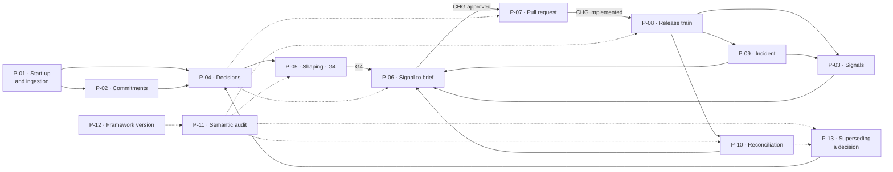

Solid arrows are the ordinary path: one process hands its output to the next. Dotted arrows
do not advance the work — they are the processes the others call into. `P-04` is what a
cycle or a pull request stops on when it meets a choice nobody has made; `P-11` is read
before a gate rather than on a date; `P-12` is what says whether the validator the audit
just ran is the one this project is supposed to be running.

## P-01 · Start-up and ingestion

**Status:** runnable.

### Trigger

A new project, a folder of documents, an existing product with no documentation, or a
solution that has already been sold.

### Actors

- `UB`: explains the products, the customers, the promises, the outcomes and where the
  corpus came from.
- `ADMIN`: sets up the repository, the framework and the ownership.
- `DEV`: helps reconstruct the system if one already exists.
- `UF`: contributes indirectly, through interviews and feedback inside the corpus.

### How it runs

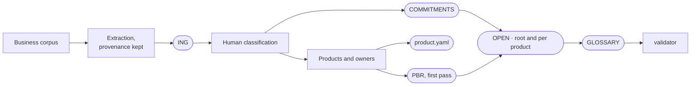

If the solution has already been sold, the reverse discovery runs first:

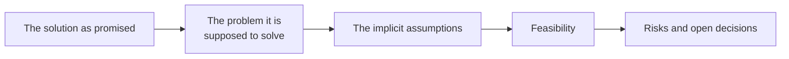

### Skill

`start`. The skill extracts and structures. It must not invent evidence, commitments or
decisions.

## P-02 · Keeping the commitments in sync

**Status:** runnable.

### Trigger

The business sends a proposal, promises a capability, communicates a date, changes
commercial terms, or describes as available something that does not exist yet.

### Actors

- `UB`: the source, and responsible for the commercial meaning.
- `ADMIN`: judges the technical feasibility and impact.
- `DEV`: contributes to the feasibility where needed.
- `UF`: the eventual recipient of the promise.

### How it runs

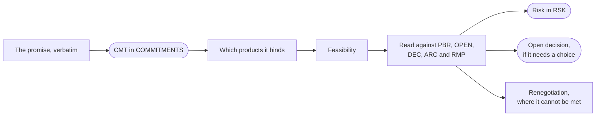

A promise does not produce a `CHG` directly: it enters the next intake.

### Skill

`requirement`, for getting the promise in.

**No script checks, before a release, which commitments were due** — and that is the right
place to leave it. `release` compares the `EVR` against the `EVP`, not against
`COMMITMENTS`, and the validator has no check on `CMT` deadlines; there would not even be a
field to run it over, because a promise with a date inside it is the same thing `REG009`
refuses on an open decision. Whether a promise and its measurement still agree is left to
the **second pass of `audit`**, which is semantic: the pair *numeric promise in
`COMMITMENTS` ↔ threshold in `EVP`* is already in its table, together with *`CMT` beyond
technical reach ↔ `RSK §state` and `OPEN`*. It is a reading, not a check, and it is worth
exactly as much as somebody asking for it.

One half of that second pair is now mechanical, and it is the half about responsibility
rather than about truth: `XP007` reports a commitment out of technical reach, or
`unsatisfiable`, that no live risk names. Whether the risk says something true, whether the
entry in `OPEN.md` is there and whether the renegotiation has actually been had stay in the
second pass, where they belong. The check exists because `ICG` §3 now passes over a candidate
that contradicts a promise already written off — stopping it never made the promise possible,
and the alternative is the same call blocking the same candidates in every cycle. That is
only safe while a write-off cannot make a row disappear quietly, and `XP007` is what keeps
it from doing so.

## P-03 · Collecting and sweeping the signals

**Status:** runnable, integration still to build.

### Trigger

Events, and the events are the sources themselves: a user's feedback, a commercial request,
an issue, a ticket, an alert, a metric that moved, an incident, a technical observation. An
explicit sweep of the sources that do not arrive on their own happens **when a cycle opens**
(`P-06`) and **after a release** (`P-08`), the two moments where the cost of a signal nobody
read becomes visible.

### Actors

- `UF`: generates the feedback and the observed problems.
- `UB`: brings requests, calls and commercial information.
- `DEV`: brings defects, technical limits and opportunities.
- `ADMIN`: coordinates the sweep and checks the provenance and the classification.

### How it runs

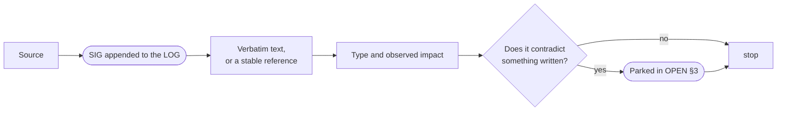

The signal is not turned into a requirement or into work here. **A signal is not a mandate**:
the only authorization in this framework is a `CHG` at `status: approved`.

### What answers "which signals has nobody looked at"

`ICG001`. The `LOG` is append-only, so a row can never be marked handled and the triage
state cannot live there: it lives in the `ICG`, where every candidate examined appears in
`routing`, including the ones routed `not-a-candidate`. The check reports the `SIG` no
classification has ever considered. It is `info` by default, and it is one of the few lines
in `framework.yaml` worth raising the first time a cycle opens and finds a four month old
signal nobody had ever read.

### Skill and integrations

`requirement`. What is still to build are the connectors or scripts for the issue tracker,
tickets, alerts and email, and they have to preserve provenance: a signal with no provenance
cannot be re-read later and is not worth the room it takes.

## P-04 · Unblocking the decisions

**Status:** runnable.

### Trigger

An open decision reaching its `trigger`; a decision blocking the shaping; an intake that
runs into a choice nobody has made; a pull request that cannot proceed without one; the
register growing past what a cycle can carry.

### Actors

- `UB`: decides product, priority, market and commitments.
- `ADMIN`: recommends, and decides the technical matters that are delegated.
- `DEV`: states constraints, options and costs without taking business decisions by
  implication.

### How it runs

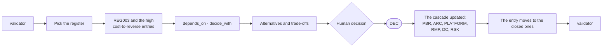

### Artifacts and skill

It touches `OPEN`, `DEC` and, depending on the decision, `PBR`, `ARC`, `PLATFORM`, `RMP`,
`DC` and `RSK`. Skill: `resolve`. It is the best supported process in the catalogue: the
skill works in cost-to-reverse order, `REG002` reports the entries a `DEC` has already
closed, and `REG003` the high cost ones with no default in force.

## P-05 · Architectural shaping and the `G4` gate

**Status:** runnable, integration still to build.

### Trigger

The to-be products are defined well enough to start the technical design of the MVP.

### Actors

- `UB`: confirms products, users, outcomes, constraints and priorities.
- `ADMIN`: leads the design and makes the decisions explicit.
- `DEV`: checks what can be implemented, at what cost and at what risk.
- `UF`: contributes indirectly, through evidence and observed workflows.

### How it runs

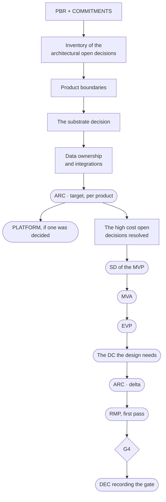

### What it leaves behind

- `ARC#target`: where the architecture is going.
- `SD`: the full design of the MVP.
- `MVA`: the decisions that are expensive to reverse and have to be taken now.
- `ARC#current`: what actually exists, updated from here on through the build.

### Why it is not a skill

`G4` is not a session: it is a sequence of them, each producing a different artifact. A
skill trying to orchestrate the whole arc would have to hold together something that lasts
days and breaks every time a decision is missing — which is to say, almost immediately.

So the split is this: **`resolve` takes the open decisions**, one at a time, as it does
everywhere else; **the `G4` gate is a checklist with a verifiable exit condition**, written
below. Whoever runs the shaping holds the checklist and calls `resolve` every time they stop
on a choice nobody has made. Extending `resolve` with a shaping path stays possible, but it
is an optimisation: it is not what is missing.

### The exit condition of `G4`

Each one verifiable by reading a document, and none of them a date:

- the decisions that are expensive to reverse have been taken, and each one has a `DEC`;
- the `MVA` is explicit in the `SD`;
- `SD`, `EVP`, `DC` and `ARC#target` exist and hold no placeholders (`FM004`);
- `ARC#delta` is the difference between `#current` and `#target`, and every row of the delta
  has an increment in the `RMP` or a line saying why not;
- what is still open has a sustainable `default_in_force` (`REG003` reports no uncovered
  high cost entries);
- the gate itself is recorded in a `DEC`. A gate that leaves no written trace is not a gate,
  it is a meeting.

## P-06 · From signal to brief

**Status:** runnable.

### Trigger

A new cycle of work opens. A cycle opens when there is something to decide about building:
new evidence in the `LOG`, an `ARC#delta` that moved, a new `DEC` or `CMT`, an `RMP`
increment that has become ripe.

### Actors

- `UB`: decides the outcome and the priority.
- `ADMIN`: classifies the impacts and coordinates the reshaping.
- `DEV`: judges feasibility and contributes the acceptance criteria.
- `UF`: is represented by the signals and the evidence collected.

### How it runs

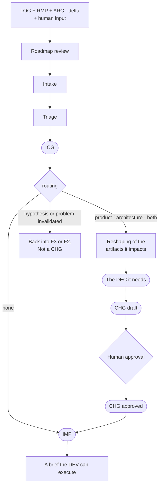

### The roadmap review is the first step, not a process of its own

It used to be one. It came back in here because in the framework the `RMP` is one of the
artifacts of the **reshaping**, which is a step this process already performs, and because
its trigger — new evidence, an `ARC#delta` that moved, a new decision or commitment — is
exactly the trigger of a cycle. Keeping them apart meant writing the same list of triggers
twice and letting the two copies drift.

Concretely, before the intake:

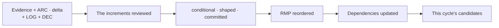

An increment with no evidence and no decision behind it stays in the `RMP`: it does not
enter the `IMP`.

### Data contracts

> **If the change touches data or a schema, the `DC` for it is updated and versioned, and
> its consumers are told.**

The rule used to live in a process of its own, which was folded into this one; the `ICG`
already routes the impact on data, so what was needed was not a second process but the rule
written where the work happens. At triage it is written as `impacts: [data]` on the
candidate. From there it becomes an obligation that can be checked, in `P-07`.

### Skill

`cycle`. The process produces authorization; it does not implement code.

## P-07 · A pull request bound to a `CHG`

**Status:** runnable.

### Trigger

A `DEV` implements a `CHG` at `status: approved` and opens a pull request.

### Actors

- `DEV`: implements, and presents the evidence.
- `ADMIN`: checks the boundaries, the impacts and whether it is ready to merge.
- `UB`: steps in only where business criteria are involved.

### How it runs

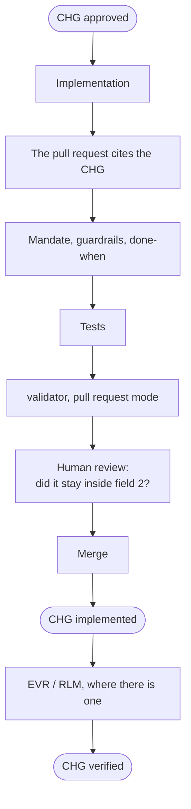

### What CI checks

The link between the pull request and the `CHG` is deterministic, so it is a check and not a
judgement. The validator runs it when it is given the pull request context:

```bash
git diff --name-only "origin/$BASE...$HEAD" > changed.txt
python3 skills/audit/scripts/validate.py --root <project> \
    --pr-text-file pr.txt --changed-files changed.txt
```

| Check | Blocks | What it says |
|---|---|---|
| `PR001` | yes | the change set cites no `CHG`: nothing authorizes it |
| `PR002` | yes | the `CHG` it cites is not in this repository |
| `PR003` | yes | the `CHG` it cites is `draft` or `rolled-back`: it is not a mandate |
| `PR004` | no | the `ICG` says the change touches `architecture`, `data` or `risk-compliance`, and the diff does not touch the artifact that owes an update |

`PR001` has one declared exception, `no-chg: <reason>` in the pull request text, and the
reason is required. A gate with no honest way out is a gate somebody deletes from the
workflow file the first time it blocks a typo.

`PR004` is where the rule about data contracts becomes executable: `impacts: [data]` with no
`DC` in the diff is a contract that changed without anybody versioning it.

`ci/PULL_REQUEST_TEMPLATE.md` and `ci/pull-request.yml` are the two files to copy into the
project. The template asks for the `CHG` in the body; the workflow runs the full validator
plus the pull request mode.

### What `audit` checks, and what it does not

`audit` runs `validate.py` over the artifacts: front matter, mandatory sections, the
reference chain, and — with the pull request context — the four checks above. Inside a pull
request that means the documents it touches have to be valid and the link to the `CHG` has
to exist.

What `audit` cannot do on its own is read the code. If the `CHG` says *what must not change*
and the pull request changes it, no check notices. That is the human review, and it is the
reason field 2 of a `CHG` exists.

### States

The `CHG` states are already in the schema — `draft → approved → implemented → verified →
rolled-back` — and `CHG001`, `CHG002` and `CHG003` already guard the transitions from the
citation side: an `ai` impact closed with no `EVR`, an `architecture` impact authorized with
no `DEC`, an authorized `CHG` naming no classification at all. What was missing was the
bridge to the pull request, not the model.

## P-08 · Release train

**Status:** runnable.

### Trigger

A set of `CHG` is `implemented` and a release candidate is cut.

### Actors

- `DEV`: produces the code, the tests and the results.
- `ADMIN`: prepares the candidate, the manifest, the tag and the deploy.
- `UB`: takes part in the approval where one is required.
- `UF`: receives the effect of the release.

### How it runs

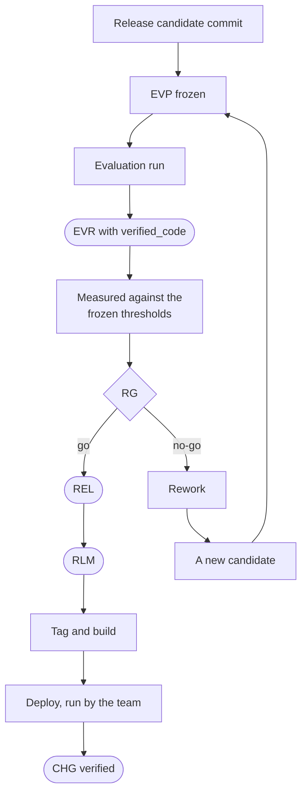

**Rework, not rollback.** Before the deploy there is nothing to go back from: rollback only
exists afterwards, when a regression shows up in production, and it comes back in through
the `LOG` like any other signal (`P-09`).

### Skill

`release`. The skill prepares the evidence and the manifest and recomputes the `evp_hash`,
which is what proves the plan it measured against is the one that was frozen; `RLM001` and
`RLM002` report a manifest with no rollback target or with the procedure declared untested.
The deploy command stays with the team.

## P-09 · Incident and recovery

**Status:** runnable, integration still to build.

### Trigger

Something goes wrong in production.

### Actors

- `UF`: reports the symptom.
- `ADMIN`: coordinates the response, the rollback and the escalation.
- `DEV`: diagnoses and fixes.
- `UB`: steps in for the commercial impact, the communication, or to accept the risk.

### How it runs

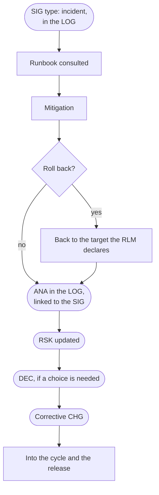

**`ANA` is not a document.** It is an entry in the `LOG`, like `SIG`: the log is append-only,
and at the moment of observation the cause and the remedy are not known yet. You do not
update the signal's row, you add a linked event — `SIG-014` observed, `ANA-014` the analysis
of `SIG-014`, `DEC-031` the decision taken on `ANA-014`, `CHG-052` the change it generated.
The analysis itself sits in `LOG §Analysis`: the cause, how it was worked out, and what would
have caught it sooner. A full post-mortem only for the events that deserve one.

The rollback that `RB` and `RLM` already provide for does not need a new `CHG`. For an
unplanned hotfix, use a minimal emergency `CHG` where that is possible; otherwise record the
action honestly and write a `CHG` afterwards to stabilise it, without pretending an
authorization that was never given.

### Skill

`requirement` writes the `SIG` and the `ANA` into the `LOG`; `resolve` where a decision is
needed; `cycle` for the corrective `CHG`; `release` to ship it; `audit` to check that `RSK`
and `LOG` still say the same thing. What is missing is a written emergency protocol, which
is prose, not necessarily a skill.

## P-10 · Reconciling the architecture with the real system

**Status:** manual.

### Trigger

After a significant release; when the code changes outside the ordinary process (a hotfix, a
change made straight in production); when `P-11` finds an `ARC#current` that does not match
what the team describes out loud.

### Actors

- `DEV`: explains the state of the repositories.
- `ADMIN`: checks the deployed state and updates the architecture.
- `UB`: steps in only if the drift changes a capability or a commitment.

### How it runs

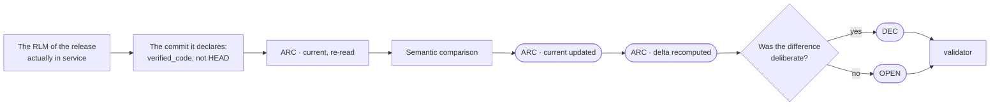

The reference must not be `HEAD` in general, but **the version `ARC#current` claims to
describe**: normally production or the last release, that is the `verified_code` of the last
`EVR` or the commit in the `RLM` of the release in service. Comparing against `HEAD`
produces a drift that is only work not yet released, and makes it look like undocumented
architecture.

### Why it is manual

`VER001`, `VER002` and `VER003` check that the attestation names repositories that exist and
leaves none of them out, but nothing here has coordinated access to the repositories or to
the real state of the deploys. A person does the comparison, by reading. The second pass of
`audit` can go with them on whether the documents agree; on the code it stops and says which
repository would have to be read.

## P-11 · Semantic audit

**Status:** runnable.

### Trigger

Before the `G4` gate; before a significant release; after a wide change to the artifacts;
when somebody asks whether the documents agree; when the check in CI is red.

### Actors

- `ADMIN`: coordinates.
- `DEV`: checks the architecture, the code and the contracts.
- `UB`: checks the product, the commitments and what the terms mean.

### How it runs

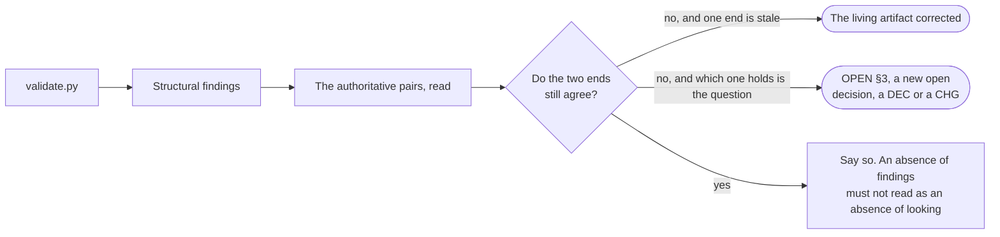

**The pairs are not listed here.** They are in `references/routing-table.md §2`, which is the
cascade, and the second pass of `audit` is that table read backwards: where the cascade says
*if you write A you must also update B*, this pass asks *does B still reflect A*. One list:
two copies of the same list drift, and that had already happened inside this document once.

Differences produce a correction to a living artifact, something parked in `OPEN §3`, a new
open decision, a `DEC` or a `CHG`. Never a correction applied unilaterally: in a
disagreement both ends can be right, and which one holds is the question.

### Skill

`audit`. The second pass does not run on every invocation — it costs a reading of the whole
artifact set — and when it has not run the skill has to say so: a clean validator report read
as "the documents agree" is exactly the silence that pass exists to remove.

## P-12 · Adopting a version of the framework

**Status:** runnable.

### Trigger

A new version of the framework, a significant bug fixed, `FW001` or `FW002` in the
validator's report, or a planned update.

### Actors

- `ADMIN`: responsible for the migration.
- `DEV`: contributes where code, CI or technical artifacts change.
- `UB`: steps in only where decision processes or business artifacts change.

### How it runs

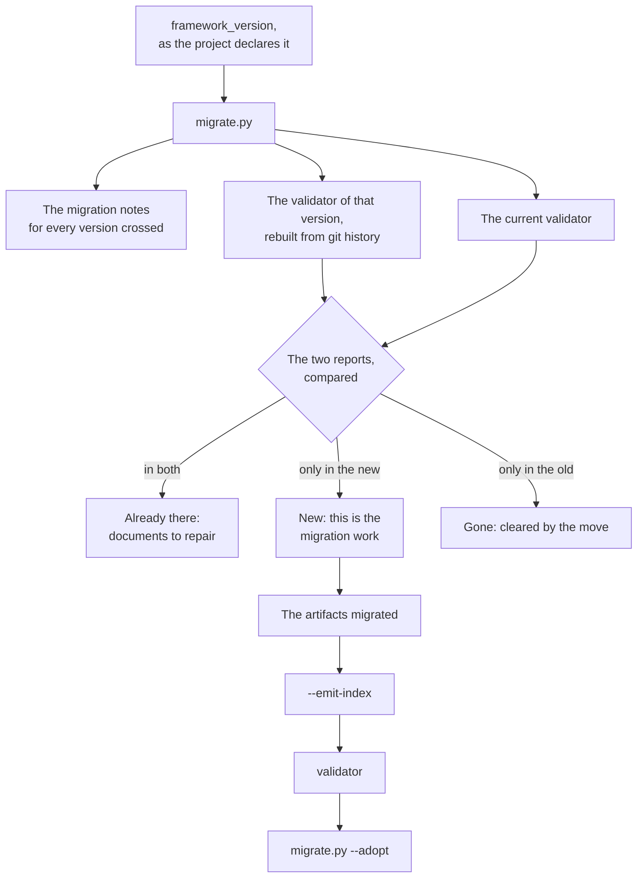

Everything above the migration itself is one command:

```bash
python3 skills/audit/scripts/migrate.py --root <project>
```

It reads the project's `framework_version`, rebuilds from the framework's own git history
the version in which that number was current, runs **that** validator and the current one
over the same project, and splits the findings three ways. It is the distinction `FW001`
exists to make possible, made finding by finding instead of as a general warning: getting it
wrong twice is how a team stops reading the validator.

`FW001` and `FW002` themselves are printed apart from the three: they are new on every
migration by construction, and `--adopt` is what clears them.

It also prints the migration note for every version crossed, read out of
`schemas/artifact-types.yaml` where each one is written beside the number it explains, and
`--adopt` writes the new `framework_version` into the project — but refuses while anything
is still under *new*, because that number is the claim that the migration is done.

### What stays by hand

Migrating the artifacts. A `MAJOR` is, by the framework's own definition, a document that
used to validate and no longer does: a renamed field, a narrowed enum, a type removed. The
script says which documents and why; the change is made by a person, or by an agent running
`audit` under that skill's rules on what may be repaired and what must be proposed.

### Skill and tooling

`audit`: `scripts/migrate.py` for the comparison, `scripts/validate.py --emit-index` to
regenerate the indices, `tests/selfcheck.py` in the framework's own repository.

## P-13 · Superseding a decision

**Status:** manual.

### Trigger

A `DEC` that is `accepted` and no longer true. Not a `DEC` somebody disagrees with, and not
one that turned out to be badly written: a decision whose content the world has moved past.

### Actors

Whoever writes the new `DEC` — `UB` for a product decision, `ADMIN` or `DEV` for an
architectural one. **There is no approver and no provisional state.** A `DEC` that supersedes
another is an ordinary `DEC` that declares what it supersedes and why. Supersession is an
event that gets recorded, not a workflow that gets run.

### How it runs

1. **Write the new `DEC`.** `supersedes: DEC-NNN` in its front matter -- a list when it
   replaces more than one -- and in the body the sentence the old one can no longer support.
   `REF002` resolves the id, `REF004` refuses a cycle.
2. **Move the old one to `status: superseded`.** That field is the only one you may touch on
   an immutable. The document **stays where it is and stays readable**: it is the reasoning
   somebody will come looking for when the same question reopens. `REF003` reports an old
   decision left at `accepted`.
3. **Then the four dependents**, in this order, because each one is somebody deciding and not
   a rewrite:

   | What depended on it | What happens |
   |---|---|
   | An `OD` with `closed_by: DEC-NNN` | `REG005` stops counting it as closed. Re-point `closed_by` at the new `DEC` when that one decides the same question; set the entry back to `status: open` when it does not, and it re-enters the ordering by cost to reverse where it belongs |
   | The `leaves_open` the old `DEC` carried | **The new `DEC` restates them.** Nothing else will: `REG012` and `REG014` skip a superseded decision, so an entry that lived only there -- the `[unregistered]` case above all -- disappears without a finding |
   | Documents citing it | `derives_from` on a `CHG`, `decided_in` in `STACK.md`. `STK001` reports the second; nothing reports the first, so it is a grep: `grep -rn DEC-NNN` |
   | The views | `validate.py --emit-index`. `ARC#current` and `PLATFORM.md` are **not** regenerated: whether the architecture still describes the system is `P-10`, and whether the documents still agree is `P-11` |

### Partial supersession

The ordinary case, and the one this framework has already produced twice: a decision that is
still right about most of what it says and wrong about one row.

**The old `DEC` stays `accepted`, and the new one quotes the part it invalidates.** Not
paraphrases it -- quotes it, so a reader who arrives from the old document recognises the
sentence that stopped being true. The alternative was to supersede the whole thing and
restate what survives, and it was not chosen: it costs a rewrite of everything that was
still true, and a rewrite of a `DEC` is the thing this class of document exists to make
unnecessary.

The price is paid with open eyes: **an `accepted` document keeps a false line inside it, and
no check will ever say so.** That is what makes the quoting obligatory rather than polite.
The habit already exists in the wild and works -- one decision opens with *"this is not a
revocation of `DEC-003`: that decision stands in full"* and then says exactly what it
narrows; another quotes *"without an attachment mechanism"* from the decision it follows and
explains why that moment has arrived. What has also happened is the other version: a later
decision that made one row of an earlier one false, said nothing about it, and left the row
sitting in a document still marked `accepted`.

When the invalidated part is the whole decision, this section does not apply: that is
supersession, and it is steps 1 to 3.

### What stays by hand

All of it. Whether a decision has been overtaken is a reading, and the four dependents are
four judgements -- which is why this is `manual` and why `audit` proposes rather than
applies.

### Skill and tooling

`requirement` or `resolve` writes the new `DEC`; `audit` reports what stayed behind
(`REF002`, `REF003`, `REF004`, `REG005`, `STK001`) and regenerates the indices with
`--emit-index`.

## Committing

`git config commit.template .gitmessage`, once per clone. Git does not ship a template with
the code, so nothing runs it for you and the reminder has to live somewhere a person reads --
which is here.

What the template says, in one line: the message ends at the last paragraph. **No trailers**
-- no `Co-authored-by`, no `Signed-off-by`, no `Generated with`.

That rule is in the repository rather than in anybody's memory because it was broken by a
session that did not have it. Six commits carried a `Co-authored-by` line naming an agent,
and GitHub builds its contributor list out of commit metadata: an agent became a contributor
to this repository, and taking it back out meant rewriting fifteen commits and force pushing
over a branch other people could already have pulled. The line costs nothing to leave out and
cannot be removed cheaply once it is in.

## What is not a process here

Three pieces of work that were catalogued and are deliberately not processes. They are
written down because the reason each one is absent is itself a decision.

- **Data contract changes.** Not a process of its own: the `ICG` already routes the impact on
  data, and a second path for the same work is a second answer. The rule survives, in `P-06`
  where it is classified and in `P-07` where it is checked.
- **Portfolio review.** Cross-product work is not a separate moment, it is a constraint
  inside the other processes. `SKILLS.md §2` says so, `XP001`–`XP005` check it on every run
  of the validator, and a standing review would add a meeting without adding a verification.
- **Onboarding a person.** It produces no artifact and has no gate: it is a reading order,
  and the `README` already has one.

The entry to the framework assumes the product has already been sold: Block A — F1 to F3,
the gates `G1`, `G2`, `G3` and the `MOR` — has no process here, on purpose. `FRAMEWORK.md §5`
covers it and declares it elastic by design.

## P-14 · Weekly business status

**Status:** runnable.

### Trigger

The weekly steering meeting needs a non-technical view of movement, current state, direction,
target, challenges and the decisions or contributions required outside development.

### Actors

- `ADMIN`: assembles the snapshot from authoritative sources; the snapshot itself has no
  owner and introduces no claim.
- `UB`: decides or acts on the items that require business input, and owns the assessment of
  commercial commitments in their authoritative register.
- `DEV`: consulted where what the product delivers today is not readable from `ARC#current`
  and the last release.

### How it runs

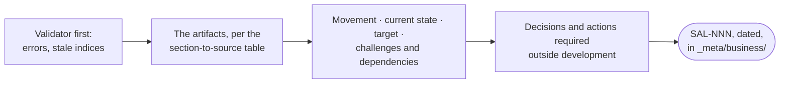

**It writes no artifact, and that is the process.** Every fact in the update is a retelling
of one that lives in `PBR`, `ARC`, `COMMITMENTS`, the registers or a release, so storing it
as a source would be the single principle broken in the one document nobody in the team
rereads. It is a dated snapshot with no document owner, in a directory the validator does
not scan, and the series answers a question no artifact does: what the business could see at
each weekly checkpoint.

If a fact appears here first, it does not belong here: it goes back through `P-02` for a
promise or `P-04` for a question, and comes back into the next update from the document that
now holds it.

### Skill

`business`. The gate before it is the validator: an update assembled from documents that
contradict each other launders drift into a sentence somebody repeats in a meeting, which is
worse than no update at all.

## Skill coverage

| Skill | Processes |
|---|---|
| `start` | P-01 |
| `requirement` | P-02, P-03, P-09 (the `SIG` and the `ANA` in the `LOG`) |
| `resolve` | P-04, the open decisions inside P-05, the decision inside P-09 |
| `cycle` | P-06, the corrective `CHG` of P-09 |
| `release` | P-08, shipping the fix from P-09 |
| `audit` | P-02 and P-11 (second pass), P-07 (pull request mode), P-10 (the documents half of it), P-12 (`migrate.py`) |
| `business` | P-14 |

One skill arrived after this table was first written, and it is `business`: P-14 has a
reader nobody else here writes for. Nothing else is missing, and what is left are
deterministic integrations and prose: the connectors
towards the issue tracker and support (`P-03`), coordinated access to the state of the
repositories and the deploys (`P-10`), the emergency protocol (`P-09`).

---

# Part II · Grouping by phase of the project

The processes are organised into five groups tied to the phases of the project, plus one
that runs across all of them.

The groups are `GP1` … `GP6` and not `G1` … `G6`: `G1`–`G4` are the lifecycle gates and mean
something else. See *Naming*.

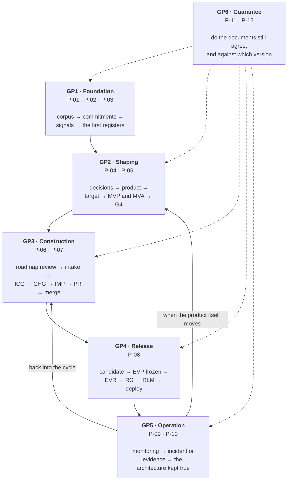

`GP1`–`GP4` take the product into production for the first time. From then on `GP5` feeds
`GP3`, or `GP2` where what moved is the product itself, while `GP6` keeps checking that the
whole documentary system stays trustworthy.

## GP1 · Foundation and understanding

**Phase:** entering the framework, initial discovery, or reconstructing an existing product.

### Processes

- P-01 — Start-up and ingestion
- P-02 — Keeping the commitments in sync
- P-03 — Collecting and sweeping the signals

### What it is for

Building a documentary base that can be trusted, by keeping apart what was observed, what
was promised, what is being asked for, and what is still to be decided.

### The flow

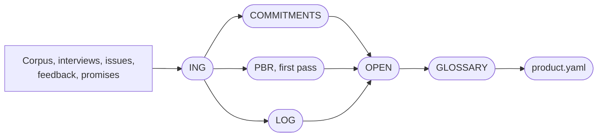

### Actors and skills

- `UB`: corpus, promises, customers and outcomes.
- `UF`: feedback and evidence of use.
- `DEV`: reconstruction of the existing system.
- `ADMIN`: repository, structure and ownership.
- Skills: `start`, `requirement`.

`P-02` and `P-03` are born in this phase and then run for the whole life of the product.

## GP2 · Defining the product and shaping the architecture

**Phase:** F1–F4, up to the `G4` gate.

### Processes

- P-04 — Unblocking the decisions
- P-05 — Architectural shaping and the `G4` gate

### What it is for

Turning incomplete knowledge into a product and an architecture defined well enough to start
the build without leaving implicit decisions to the `DEV`.

### The flow

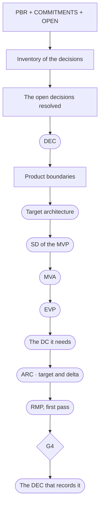

### Actors and skills

- `UB`: product, outcomes, priorities and constraints.
- `ADMIN`: architecture, alternatives and trade-offs.
- `DEV`: what can be implemented, at what cost, with what dependencies.
- `UF`: evidence and observed workflows.
- Skills: `resolve`, and the validator through `audit`.

### Exit condition

It is the checklist in `P-05`. None of its items is a date: `G4` is crossed when the
expensive decisions have been taken and written down, not when the day somebody once picked
arrives.

## GP3 · Planning and executing the change

**Phase:** F5 and the continuous build cycle.

### Processes

- P-06 — From signal to brief
- P-07 — A pull request bound to a `CHG`

### What it is for

Turning signals, roadmap and architectural delta into work that is authorized, implemented
and verifiable.

### The flow

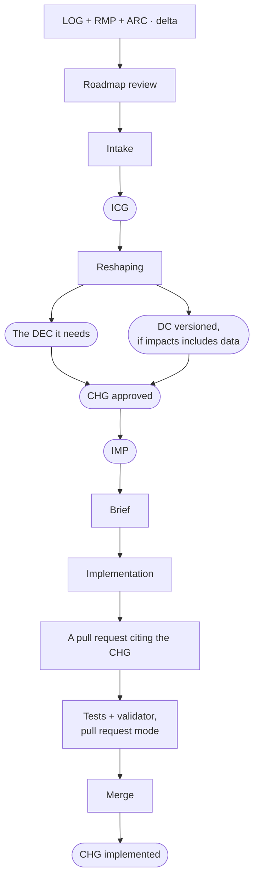

### Actors and skills

- `UB`: priorities and outcomes.
- `ADMIN`: intake, impacts and authorization.
- `DEV`: estimate, implementation, tests and the pull request.
- `UF`: the signals that feed the cycle.
- Skills: `cycle`, `audit`.

```text
SIG / commitment / RMP increment  ≠  authorization
CHG approved                      =  authorization
```

## GP4 · Evaluation, release and deploy

**Phase:** F6, from release candidate to production.

### Process

- P-08 — Release train

### What it is for

Deciding whether a version can be released, using criteria defined before anybody knew the
results.

### The flow

```mermaid
flowchart LR
  done(["CHG implemented"]) --> rc["Release candidate"]
  rc --> freeze["EVP frozen"]
  freeze --> EVR(["EVR"])
  EVR --> RG{"RG"}
  RG -->|"go"| REL(["REL and RLM"])
  REL --> dep["Build, tag, deploy"]
  dep --> ver(["CHG verified"])
  RG -->|"no-go"| rework["Rework, a new candidate"]
  rework --> rc
```

### Actors and skills

- `DEV`: code, tests and results.
- `ADMIN`: candidate, manifest, tag and deploy.
- `UB`: approval where the gate carries product responsibility.
- `UF`: on the receiving end of the release.
- Skill: `release`.

The skill prepares the evidence, the verdict, the `REL` and the `RLM`; the team runs the
deploy.

## GP5 · Operation, learning and evolution

**Phase:** Block C, the product in service.

### Processes

- P-09 — Incident and recovery
- P-10 — Reconciling the architecture with the real system

### What it is for

Using what happens in production to keep the service running, to fix the system, and to keep
the documentation true. The direction of the product changes by re-entering `GP3`: the
roadmap review is the first step of `P-06`.

### The flow

```mermaid
flowchart TB
  use["Use and monitoring"] --> LOG(["Signals, incidents, drift → LOG"])
  LOG --> inc{"Is it an incident?"}
  inc -->|"yes"| RB["Runbook, mitigation<br/>or rollback via the RLM"]
  RB --> ANA(["ANA in the LOG"])
  ANA --> RSK(["RSK"])
  RSK --> DEC(["DEC"])
  DEC --> CHG(["CHG"])
  CHG --> rel["A new release"]
  inc -->|"no"| cyc["Into the next intake"]
  LOG --> rec["Reconciliation:<br/>the running code against ARC · current"]
  rec --> upd(["ARC updated, delta recomputed"])
  upd --> drift{"Deliberate?"}
  drift -->|"yes"| DEC
  drift -->|"no"| OPEN(["OPEN"])
```

### Actors and skills

- `UF`: feedback, incidents and signals of use.
- `DEV`: diagnosis, correction and technical judgement.
- `ADMIN`: operation, rollback and reconciliation.
- `UB`: commercial impact and priority.
- Skills: `requirement`, `audit`, `cycle`, `release`, and `resolve` where a decision is
  needed.

### Missing integrations

- access to the real state of the deploys;
- a comparison between the `RLM` and the repository commits;
- the emergency protocol;
- the link between monitoring and the `LOG`.

## GP6 · Guaranteeing and maintaining the framework

**Phase:** across the whole project.

### Processes

- P-11 — Semantic audit
- P-12 — Adopting a version of the framework

### What it is for

Making sure the documents keep describing the same system, that the validator agrees with
the version the project declares, and that a change in the framework is not mistaken for a
defect in the project.

### The flow

```mermaid
flowchart LR
  val["validate.py"] --> str["Structural findings"]
  str --> pairs["The authoritative pairs,<br/>routing-table §2 read backwards"]
  pairs --> corr["Corrections, open decisions,<br/>DEC or CHG"]
  fw["A new framework version"] --> mig["migrate.py"]
  mig --> split["already there · new · gone"]
  split --> art["The artifacts migrated"]
  art --> idx["--emit-index"]
  idx --> val
  val --> adopt["migrate.py --adopt"]
```

### Actors and skills

- `ADMIN`: the main owner.
- `DEV`: migrations that touch code, CI or technical artifacts.
- `UB`: only where decision processes or business artifacts change.
- Skills: `audit`, with `scripts/migrate.py` and `scripts/validate.py`; `tests/selfcheck.py`
  in the framework's own repository.

## Summary

| Group | Phase | Processes |
|---|---|---|
| GP1 — Foundation and understanding | entry and discovery | P-01, P-02, P-03 |
| GP2 — Definition and shaping | F1–F4, up to `G4` | P-04, P-05 |
| GP3 — Planning and execution | F5 and the build cycles | P-06, P-07 |
| GP4 — Evaluation and release | F6 | P-08 |
| GP5 — Operation and evolution | Block C | P-09, P-10 |
| GP6 — Guaranteeing the framework | across all of it | P-11, P-12 |

## What actually holds today

Twelve processes, and not all of them supported the same way. In order of how much the
framework really carries them:

| | Processes |
|---|---|
| Skills, artifacts and checks exist | P-01, P-02, P-04, P-06, P-07, P-08, P-11, P-12 |
| The process holds, an integration is named and absent | P-03, P-05, P-09 |
| The framework says what to do, nothing assists it | P-10 |

None of this is a commitment to run all of them every week. They are written down so that
when one of them is needed, the question *who does what, and what has to stay written* has
an answer already instead of being improvised.
